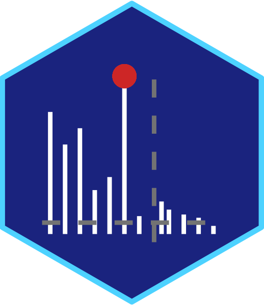

# ms_for_sirius 

### Description :bookmark_tabs:
The [Shiny App](https://shiny.posit.co/) for generating an individual .ms file from user-provided MS spectra in 2 levels for one single compound. Spectra can be provided in .txt or pasted directly from the clipboard through e.g. [ElMaven](https://github.com/ElucidataInc/ElMaven). The obtained file is suitable for processing in [SIRIUS](https://bio.informatik.uni-jena.de/software/sirius/). It is also possible to filter by precursor mass and relative abundance, which provides a tidy formatting for the search query in [GNPS](https://fasst.gnps2.org/fastsearch/), [MassBank](https://massbank.eu/MassBank/search), and [BUDDY](https://github.com/Philipbear/BUDDY_Metabolomics). In addition, it is possible to generate .mgf (ms2 only) file for reading/searching in [NIST MS Search](https://chemdata.nist.gov/mass-spc/ms-search/), [MetaboScape](https://www.bruker.com/en/products-and-solutions/mass-spectrometry/ms-software/metaboscape.html), SIRIUS, etc. Also, functionality was added to build a mirror plot from the reference spectra.

### Launch the App :rocket:
Shiny deployment:<br>
[**`https://plyush1993.shinyapps.io/ms_for_sirius/`**](https://plyush1993.shinyapps.io/ms_for_sirius/) <br><br>
Run locally:
```r
cat("Checking required packages (auto-installing if missing)\n")
if (!requireNamespace("pacman", quietly = TRUE)) install.packages("pacman")
pacman::p_load("shiny", "DT", "ggplot2", "shinythemes", "shinyWidgets", "shinyjs", "BiocManager")
if (!requireNamespace("Spectra", quietly = TRUE)) BiocManager::install("Spectra")
if (!requireNamespace("MsBackendMgf", quietly = TRUE)) BiocManager::install("MsBackendMgf")

source("https://raw.githubusercontent.com/plyush1993/ms_for_sirius/refs/heads/main/app.R")
shiny::shinyApp(ui, server)
```
<br>

> [!IMPORTANT]
>The [App's script](https://github.com/plyush1993/Metabocano/blob/main/app.R) was compiled using [R version 4.1.2](https://cran.r-project.org/bin/windows/base/old/4.1.2/) 
<br>

### Contact :mailbox_with_mail:
Please send any comment, suggestion or question you may have to the author (Dr. Ivan Plyushchenko):  
<div> 
  <a href="mailto:plyushchenko.ivan-@gmail.com"></a>
  <a href="https://github.com/plyush1993"></a>
  <a href="https://orcid.org/0000-0003-3883-4695"></a>
</div>
